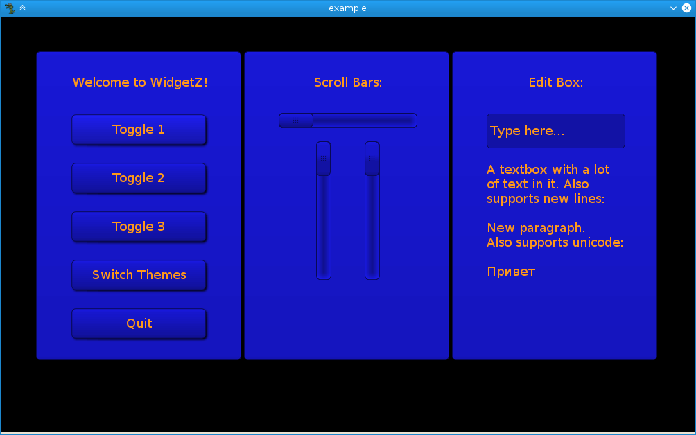

# Widget Z



WidgetZ is a low-feature C GUI library for use with Allegro 5. It's features include:

- Simple API
- A variety of widgets (buttons, toggles, scroll bars, edit boxes, static text holders)
- Simple layout support
- Uses Allegro 5's event system
- Basic theme support
- Cross platform

## Documentation

[Documentation](https://siegelord.github.io/WidgetZ/)

## Requirements

- Allegro 5 (image, font and primitives addons)
- CMake
- NaturalDocs (documentation only)

## Installation

Standard CMake building instructions apply. Starting in the WidgetZ root directory do:

```
mkdir build && cd build
cmake ..
make
make install
```

Last command may need to be ran at root if you're on Linux. This will build the library and install it into the standard location. It will also build the example, which you can run from the build directory.

If you want the documentation, run build_docs.sh script. It will generate HTML documentation in the docs/ folder.

## License

WidgetZ is licensed using the ZLib license, reproduced in the LICENSE file. The 9 patch implementation was done by Matthew Leverton and its license is also in the LICENSE file.

The DejaVuSans.ttf font that comes with the example is licensed under the license found here:

dejavu-fonts.org/wiki/index.php?title=License

